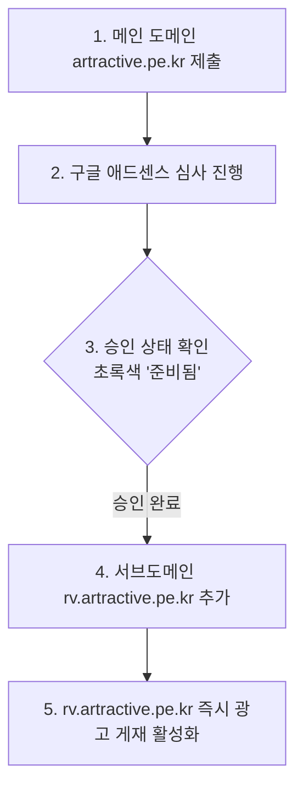

# 구글 애드센스(Google AdSense) 연동 및 운용 가이드

## 1. 개요 (Overview)
본 문서는 Reverse Voice 웹 게임(`https://rv.artractive.pe.kr/`)의 수익화를 위한 구글 애드센스(Google AdSense) 연동 현황, 적용된 코드 구조, 그리고 메인 도메인 승인 후 최종 완료해야 할 작업 절차를 정리합니다.

---

## 2. 게시자 정보 및 적용 현황

| 항목 | 내용 |
| :--- | :--- |
| **게시자 ID (Publisher ID)** | `pub-3819448456075603` |
| **메인 도메인** | `https://artractive.pe.kr/` (심사 승인 주체) |
| **서브 도메인** | `https://rv.artractive.pe.kr/` (실제 서비스 & 광고 게재) |
| **현재 연동 상태** | 코드 연동 완료 (상위 도메인 승인 대기 중) |

---

## 3. 구현 내역 (Implementation Details)

### 3.1 `ads.txt` 설정 ([ads.txt](file:///home/tramp/Projects/ReversVoice/ads.txt))
웹사이트 루트 경로에 게시자 식별 신뢰 파일이 배치되었습니다:
```text
google.com, pub-3819448456075603, DIRECT, f08c47fec0942fa0
```

### 3.2 HTML 스크립트 및 광고 슬롯 설정 ([index.html](file:///home/tramp/Projects/ReversVoice/index.html))
- **Header Script (`<head>`)**: 구글 애드센스 SDK 라이브러리 비동기 로드
  ```html
  <script async src="https://pagead2.googlesyndication.com/pagead/js/adsbygoogle.js?client=ca-pub-3819448456075603" crossorigin="anonymous"></script>
  ```
- **Top Ad Banner Slot (`.ad-container`)**: 헤더 하단에 자동 반응형 광고 슬롯 구성
- **Mid Ad Banner Slot (`.ad-container`)**: 메인 카드 섹션과 SEO 콘텐츠 섹션 사이에 광고 슬롯 구성

---

## 4. 향후 처리 절차 (Action Plan & Next Steps)



### 4.1 메인 도메인(`artractive.pe.kr`) 승인 완료 시 할 일
1. 구글 애드센스 대시보드 로그인 (`https://adsense.google.com/`)
2. 좌측 메뉴에서 **[사이트]** 클릭
3. 승인된 메인 도메인 **`artractive.pe.kr`** 클릭
4. **[서브도메인 세부정보]** 또는 **[서브도메인 추가]** 버튼 선택
5. **`rv.artractive.pe.kr`** 입력 후 추가 완료
6. 추가 즉시 별도의 재심사 없이 `rv.artractive.pe.kr` 웹사이트에 실시간 광고가 표시되기 시작함.

### 4.2 운영 및 품질 유지 관리 (AdSense Policy Compliance)
- **가이낸스 준수**: 사용자 유기적인 클릭 유도 금지 (자가 클릭 금지).
- **콘텐츠 비율 유지**: [PRD.md](file:///home/tramp/Projects/ReversVoice/Doc/PRD.md)에 따라 '가치 없는 콘텐츠' 거절 방지를 위해 작성된 게임 가이드, 마이크 FAQ, 제시어 50선 등 SEO 텍스트 세그먼트를 훼손하지 않고 유지할 것.
- **모바일 UX 최적화**: 버튼 터치 영역(`56px` 이상)과 광고 슬롯 간 여백 유지하여 오클릭 발생 방지.

---

## 5. 트러블슈팅 및 참고사항
- **광고 영역이 빈 상자로 노출되는 현상**: 애드센스 승인 직후 24~48시간 동안 광고 빈도가 조정되며 빈 영역(White space)으로 보일 수 있으며, 정상적인 현상입니다.
- **ads.txt 경고 메시지**: 구글 애드센스 콘솔에서 `ads.txt` 경고가 나타날 경우, `https://rv.artractive.pe.kr/ads.txt`로 정상 접속되는지 확인 후 1~2일 기다리면 자동으로 해제됩니다.
